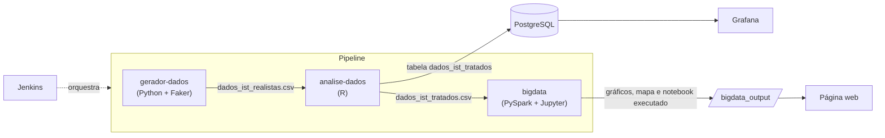

# UNIFEOB - PI Data Science 2025.1

**Título do Projeto:** Automação e Escalabilidade de Pipelines de Big Data
**Subtítulo:** Impacto de doenças IST no Brasil

## 👥 Equipe

| Nome                              | RA       | Papel (SM/PO/Membro) | Responsabilidades                                                                                                                                                              |
| :-------------------------------- | :------- | :------------------- | :----------------------------------------------------------------------------------------------------------------------------------------------------------------------------- |
| Caio Grilo da Cunha               | 22000246 | Product Owner        | Priorização de tarefas, validação de entregas, Entregas Gerais, Implementação de pipelines CI/CD e monitoramento de desempenho, Limpeza, transformação e visualização de dados |
| Gian Carlos de Freitas Moroni     | 22000843 | Scrum Master         | Gestão do cronograma, reuniões diárias, Aplicação estatística na análise de dados, Elaboração de modelos probabilísticos e geração de insights                                 |
| Haryel Araújo de Oliveira Caliari | 22001470 | Membro               | Escalabilidade e Eficiência na infraestrutura de dados                                                                                                                         |
| Jackeline Ayumi Kanekiyo          | 22001803 | Membro               | Gerenciamento e processamento de dados, Implementação de arquiteturas distribuídas e Otimização da performance dos dados.                                                      |

---

## Objetivo e Descrição da Solução

Este projeto tem como objetivo principal demonstrar a construção e automação de um **pipeline de dados** completo, desde a geração de dados simulados até a análise, visualização e aplicação de modelos de Machine Learning (ML) em um contexto de saúde pública, focado em **Infecções Sexualmente Transmissíveis (ISTs)**.

A solução é modularizada usando **Docker Compose**, o que garante um ambiente isolado, consistente e reprodutível. O pipeline abrange as seguintes etapas:

1.  **Geração de Dados Simulados:** um serviço em Python cria registros de pacientes (dados demográficos, de saúde e de localização) com ruídos intencionais — grafias inconsistentes, campos vazios, outliers e datas futuras — simulando o preenchimento humano.
2.  **Análise e Tratamento com R:** análise exploratória (estatísticas descritivas, outliers), imputação de valores ausentes e padronização das categorias.
3.  **Armazenamento:** os dados tratados são gravados em CSV (consumido pelo Spark) e no **PostgreSQL** (consumido pelo Grafana).
4.  **Processamento e Análise de Big Data (Spark):** um notebook Jupyter, executado automaticamente, realiza:
    - Pré-processamento e engenharia de features;
    - Processamento de Linguagem Natural (TF-IDF);
    - Construção de um Data Warehouse (esquema estrela) e análises OLAP em Spark SQL;
    - Agregações no paradigma Hadoop MapReduce;
    - Classificação (Regressão Logística, Random Forest, Naive Bayes) para prever a presença de ISTs;
    - Clusterização (K-Means) para identificar perfis de pacientes;
    - Geração de gráficos e de um mapa interativo.
5.  **Visualização e Monitoramento (Grafana):** dashboards interativos sobre os dados no PostgreSQL.
6.  **CI/CD (Jenkins):** execução automatizada e periódica de todo o pipeline.

## Arquitetura



Cada etapa é um container independente, que se comunica com as demais apenas por **arquivos no volume
compartilhado `data/`** ou pelo **PostgreSQL**. Isso permite executar, testar e evoluir cada etapa isoladamente.

### Decisões de projeto

- **Separação entre lógica e apresentação:** a etapa de Big Data é um pacote Python (`ist_bigdata`), com um módulo por
  responsabilidade (pré-processamento, PLN, warehouse, OLAP, MapReduce, classificação, clusterização...). O notebook
  apenas orquestra as chamadas e documenta os resultados, funcionando como relatório executável.
- **Configuração centralizada:** constantes de domínio (lista de ISTs, doenças curáveis, coordenadas, hiperparâmetros)
  ficam em um módulo `config` por serviço; credenciais e portas vêm de variáveis de ambiente (`.env`), com valores
  padrão para que o projeto rode sem nenhuma configuração extra.
- **Funções pequenas e composáveis no R:** exploração, tratamento e exportação ficam em arquivos separados, e o
  tratamento é encadeado com o operador pipe (`|>`), tornando explícita a ordem das transformações.
- **Resiliência na orquestração:** a etapa em R aguarda o CSV do gerador e a disponibilidade do PostgreSQL antes de iniciar.

## Tecnologias Utilizadas

- **Docker** e **Docker Compose**: orquestração dos containers e do ambiente.
- **Python**: 3.11 no `gerador-dados` e 3.9 no `bigdata`.
  - **PySpark 3.4.4**: processamento de Big Data.
  - **Pandas** e **Numpy**: manipulação de dados e computação numérica.
  - **Scikit-learn**: métricas de avaliação dos modelos.
  - **Matplotlib**, **Seaborn**, **Folium**: gráficos e mapa interativo.
  - **Faker**: geração de dados simulados.
- **R**: análise estatística e tratamento dos dados.
  - **`knitr`, `ggplot2`, `dplyr`, `tidyr`, `tools`, `RPostgreSQL`**: análise, manipulação e conexão com PostgreSQL.
- **PostgreSQL 15**: banco de dados relacional.
- **Grafana 10.4.1**: visualização e monitoramento.
- **Jenkins**: CI/CD.

---

## Estrutura do Projeto

```
.
├── docker-compose.yml            # Orquestração de todos os serviços
├── Jenkinsfile                   # Pipeline de CI/CD
├── .env.example                  # Credenciais e portas (opcional)
│
├── services/                     # Etapas do pipeline de dados
│   ├── gerador_dados/            # 1. Geração de dados simulados (Python)
│   │   ├── Dockerfile
│   │   ├── requirements.txt
│   │   └── gerador/
│   │       ├── config.py         #    Distribuições, cidades e probabilidades de ruído
│   │       ├── geradores.py      #    Geração de cada atributo do registro
│   │       └── __main__.py       #    Ponto de entrada (python -m gerador)
│   │
│   ├── analise_r/                # 2. Análise exploratória e tratamento (R)
│   │   ├── Dockerfile
│   │   ├── entrypoint.sh         #    Aguarda CSV + PostgreSQL e executa a análise
│   │   └── R/
│   │       ├── main.R            #    Orquestra: importação -> exploração -> tratamento -> exportação
│   │       ├── config.R
│   │       ├── exploracao.R
│   │       ├── tratamento.R
│   │       └── exportacao.R
│   │
│   └── bigdata/                  # 3. Big Data e Machine Learning (PySpark)
│       ├── Dockerfile
│       ├── requirements.txt
│       ├── main.ipynb            #    Relatório executável (orquestra o pacote abaixo)
│       └── ist_bigdata/
│           ├── config.py         #    Constantes de domínio e hiperparâmetros
│           ├── sessao.py         #    SparkSession e leitura dos dados
│           ├── preprocessamento.py
│           ├── pln.py
│           ├── warehouse.py
│           ├── olap.py
│           ├── mapreduce.py
│           ├── temporal.py
│           ├── geo.py
│           ├── classificacao.py
│           ├── clusterizacao.py
│           └── graficos.py
│
├── infra/
│   ├── grafana/                  # Provisionamento e dashboard do Grafana
│   └── jenkins/                  # Imagem do Jenkins com Docker CLI
│
├── web/                          # Página estática com os resultados
│   ├── index.html
│   └── style.css
│
├── data/                         # (gerado) CSVs bruto e tratado
└── bigdata_output/               # (gerado) Notebook executado, gráficos e mapa
```

## Como Instalar e Executar o Projeto

### Pré-requisitos

- **Docker Desktop** (inclui Docker Engine e Docker Compose) — [download](https://www.docker.com/products/docker-desktop)

### Passos para Execução

1.  **Navegue até o diretório do projeto** (onde está o `docker-compose.yml`):

    ```bash
    cd /caminho/para/algoritmo-doenca-ist
    ```

2.  **(Opcional) Configure credenciais e portas:**

    ```bash
    cp .env.example .env
    ```

    Sem o `.env`, são usados os mesmos valores padrão listados no `.env.example`.

3.  **Crie a pasta de saída:**

    ```bash
    mkdir bigdata_output
    ```

4.  **Execute o Docker Compose:**

    ```bash
    docker compose up --build
    ```

    - A flag `--build` força a reconstrução das imagens, garantindo que alterações nos Dockerfiles e no código sejam aplicadas.
    - Para rodar apenas o `bigdata` e suas dependências: `docker compose up --build bigdata`.

5.  **Acompanhe os logs:**

    ```bash
    docker compose logs -f bigdata
    ```

6.  **Verifique os resultados** em `bigdata_output/` (o container `bigdata` encerra após o `nbconvert` terminar):

    - `resultado_main.ipynb`: notebook com todas as células executadas e suas saídas;
    - Gráficos OLAP: `casos_por_localidade.png`, `media_idade_por_doenca.png`, `media_renda_por_escolaridade_e_doenca.png`, `casos_por_ano_olap.png`;
    - Gráficos MapReduce: `media_renda_mapreduce.png`, `distribuicao_faixa_etaria_mapreduce.png`;
    - `casos_por_ano.png`;
    - Modelos: `matriz_confusao.png`, `curva_roc.png`, `metodo_cotovelo.png`, `clusters_kmeans.png`;
    - `mapa_casos_localidade.html`: mapa interativo.

    Para uma visão consolidada, abra `web/index.html` no navegador.

7.  **Grafana:** acesse [http://localhost:3000](http://localhost:3000) (usuário/senha padrão: `admin`/`admin`).

8.  **Parar e remover os containers:**

    ```bash
    docker compose down      # mantém os volumes (dados do PostgreSQL e Grafana)
    docker compose down -v   # remove também os volumes
    ```
