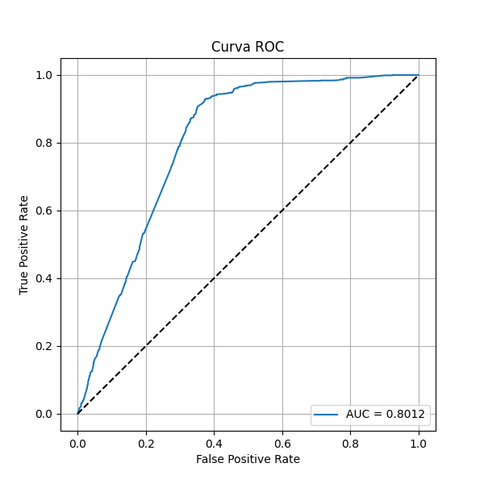
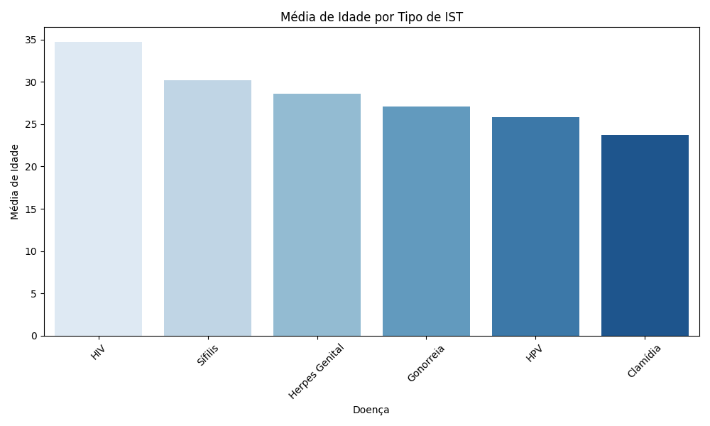

# Automação e Escalabilidade de Pipelines de Big Data

**Impacto de Infecções Sexualmente Transmissíveis (ISTs) no Brasil**

Caio Grilo da Cunha · Gian Carlos de Freitas Moroni · Haryel Araújo de Oliveira
Caliari · Jackeline Ayumi Kanekiyo
Projeto Integrador de Data Science, UNIFEOB (São João da Boa Vista, SP),
2025.1 · revisão metodológica em 2026

---

## Resumo

Dados de vigilância em saúde chegam de várias fontes, são preenchidos à mão e
trazem inconsistências. Este trabalho desenvolveu um pipeline de dados
conteinerizado, de ponta a ponta, para analisar registros de ISTs: geração,
tratamento estatístico, processamento distribuído, aprendizado de máquina e
visualização.

- **Pipeline:** cinco etapas isoladas em containers (Python, R, PySpark,
  PostgreSQL e Grafana), orquestradas por Docker Compose e Jenkins e
  executáveis com um único comando.
- **Tratamento:** 10.000 registros simulados com ruído de preenchimento
  humano (grafias inconsistentes, campos ausentes, outliers e datas
  impossíveis), padronizados e validados em R.
- **Classificação:** para prever a presença de IST a partir de dados
  demográficos, o **Random Forest** atingiu **AUC de 0,80**, mas a acurácia
  (**65,1 %**) ficou praticamente igual ao baseline (**64,9 %**), por causa
  do desbalanceamento das classes.
- **Revisão:** a primeira versão relatava **100 % de acurácia**. A revisão
  mostrou que o número vinha de **vazamento de dados** e corrigiu esse e
  outros seis problemas.

**Palavras-chave:** big data; Apache Spark; engenharia de dados; aprendizado
de máquina; vazamento de dados; saúde pública; ISTs.

## Motivação

As ISTs são um problema persistente de saúde pública. A Organização Mundial da
Saúde tem metas globais de controle para o período 2022–2030 (WHO, 2022), e no
Brasil o manejo dessas infecções segue protocolos nacionais do Ministério da
Saúde (Brasil, 2022). Monitorar essas doenças depende de dados de
notificação, e esses dados raramente estão limpos: há campos vazios, grafias
divergentes e registros inválidos.

Transformar dados assim em informação confiável exige mais do que um modelo.
É preciso uma infraestrutura **reprodutível**, que trate os dados de forma
explícita e auditável e que escale com o volume. Este trabalho combina:

- **Processamento distribuído** com Apache Spark (Zaharia et al., 2016) e o
  paradigma MapReduce (Dean & Ghemawat, 2008).
- **Modelagem dimensional** em esquema estrela para análises OLAP (Kimball &
  Ross, 2013).
- **Aprendizado supervisionado e não supervisionado** avaliado com métricas
  adequadas a classes desbalanceadas (Fawcett, 2006; He & Garcia, 2009).

## Dados

Os dados são **sintéticos**, gerados com a biblioteca Faker (`pt_BR`). As
distribuições foram definidas para imitar um cenário plausível, e o ruído foi
inserido de propósito para exercitar a etapa de tratamento.

| Item | Valor |
|------|-------|
| Registros | **10.000** por execução |
| Atributos | id, nome, gênero, idade, doença, localidade, escolaridade, renda, data do teste |
| Doenças | 6 ISTs (HIV, Sífilis, Gonorreia, HPV, Clamídia, Herpes Genital), 5 outras doenças e "Nenhuma" |
| Proporção de ISTs | **~36 %** dos registros |
| Localidades | 41 cidades das cinco regiões do país |

**Tabela 1.** Ruído inserido nos dados brutos.

| Tipo de ruído | Exemplo | Frequência |
|---------------|---------|------------|
| Grafias inconsistentes | `"m"`, `"masculino"`, `"superio"`, `"fundamnetal"` | gênero e escolaridade |
| Categoria ausente | gênero, localidade, escolaridade | 10–20 % |
| Renda ausente | — | 2 % |
| Outliers de idade e renda | 0–5 ou 90–100 anos; R$ 5–100 ou R$ 30–100 mil | 1 % cada |
| Data de teste no futuro | até ~3 anos à frente | 2 % |

A idade depende da doença: cada IST tem uma média e um desvio próprios (por
exemplo, 35 ± 7 anos para HIV e 24 ± 5 para Clamídia).

## Metodologia

Implementado com Python 3.11 (geração), R (tratamento), PySpark 3.4
(processamento e ML), PostgreSQL 15, Grafana 10 e Jenkins, todos em containers
Docker.

```
 ETAPA 1  Ingestão       Faker (pt_BR) ─► dados_ist_realistas.csv (10.000 registros com ruído)
                                                    │
                                                    ▼
 ETAPA 2  Tratamento     R: exploração ─► imputação ─► padronização ─► validação
                                                    │
                                   ┌────────────────┴────────────────┐
                                   ▼                                 ▼
                         dados_ist_tratados.csv                PostgreSQL ─► Grafana
                                   │
                                   ▼
 ETAPA 3  Processamento  PySpark: esquema estrela ─► OLAP (Spark SQL) · MapReduce (RDD) · TF-IDF
                                   │
                                   ▼
 ETAPA 4  Modelagem      features ─► LR | Random Forest | Naive Bayes     (classificação)
                                 ─► StandardScaler ─► K-Means ─► PCA     (clusterização)

          Orquestração   Docker Compose (execução local) · Jenkins (execução periódica)
```

### Tratamento dos dados

1. **Exploração:** estatísticas descritivas, boxplots e detecção de outliers
   pela regra do IQR.
2. **Renda ausente:** imputação pela **mediana**, que é robusta aos outliers
   de renda (Little & Rubin, 2019).
3. **Datas futuras:** os registros são **removidos**, porque um teste não pode
   ter sido feito no futuro.
4. **Categorias:** as grafias são padronizadas. Gênero e localidade ausentes
   viram a categoria explícita **"Não Informado"**, sem imputação pela moda,
   para não inflar artificialmente o grupo majoritário.

### Processamento

- **Data warehouse:** uma tabela fato (`fato_casos`) e cinco dimensões (tempo,
  localidade, doença, escolaridade e gênero), consultadas em Spark SQL.
- **MapReduce:** média de renda por IST e distribuição por faixa etária,
  implementadas com `map` e `reduceByKey` sobre RDDs.

### Classificação

- **Tarefa:** classificação binária, `tem_ist` (1 se a doença é uma IST).
- **Features:** idade, renda, gênero, localidade e escolaridade (as três
  últimas com one-hot encoding). A coluna `doenca` é **excluída**, porque o
  rótulo é derivado dela (veja [Revisão](#revisão-metodológica)).
- **Divisão:** treino/teste 70/30 (`seed=42`).
- **Modelos:**

| Modelo | Configuração |
|--------|--------------|
| Regressão Logística | `maxIter=10` |
| Random Forest (Breiman, 2001) | `numTrees=10` |
| Naive Bayes | multinomial (padrão do Spark) |
| Baseline | sempre prevê a classe majoritária |

### Clusterização

As features são padronizadas (média 0, desvio 1) antes do **K-Means** (Jain,
2010). K varia de 2 a 7 pelo método do cotovelo, e os grupos com K = 4 são
projetados em duas dimensões por **PCA**.

## Resultados

Valores de uma execução de referência. Como os dados são gerados a cada
execução, os números variam levemente, mas os padrões se mantêm.

### Tratamento

**Tabela 2.** Efeito do tratamento sobre os dados brutos.

| Etapa | Resultado |
|-------|-----------|
| Registros removidos por data futura | 206 (2,1 %), restando **9.794** |
| Rendas imputadas pela mediana | 202 (mediana de R$ 1.831,50) |
| Gênero padronizado | 10 variantes → Masculino (6.006), Feminino (1.877), Não Informado (1.911) |
| Escolaridade padronizada | 7 variantes → Fundamental (5.606), Superior (2.788), Médio (1.400) |
| Localidade ausente | 993 registros → "Não Informado" |

### Classificação

**Tabela 3.** Desempenho no conjunto de teste (2.840 amostras).

| Modelo | Acurácia | AUC | Recall (classe 0 / classe 1) |
|--------|----------|-----|------------------------------|
| Baseline (classe majoritária) | 64,86 % | 0,500 | 1,00 / 0,00 |
| **Random Forest (campeão)** | **65,14 %** | **0,801** | **0,98 / 0,04** |
| Regressão Logística | 58,84 % | — | — |
| Naive Bayes | 55,67 % | — | — |

- **A acurácia empata com o baseline.** O Random Forest quase sempre prevê a
  classe majoritária ("sem IST"): o recall da classe positiva é de 4 %.
- **Mas a AUC de 0,80 mostra sinal real.** As probabilidades estimadas
  separam bem as classes, e o sinal vem sobretudo da **idade**, já que cada
  IST se concentra em uma faixa etária (figura abaixo, à direita).
- A Regressão Logística e o Naive Bayes ficaram **abaixo do baseline**.

<p float="left">
  
  
</p>

> Curva ROC do Random Forest e média de idade por tipo de IST, geradas pelo
> notebook [`main.ipynb`](services/bigdata/main.ipynb).

### Clusterização

O custo (WCSS) cai de forma quase linear com K, de 476,7 mil (K = 2) para
429,5 mil (K = 7), cerca de 2 % por cluster adicional. **Não há "cotovelo".**

### Revisão metodológica

A primeira versão do projeto (2025) está preservada na tag
[`v1.0-pi-2025`](../../tree/v1.0-pi-2025). Uma revisão posterior encontrou
os problemas abaixo, e cada correção está em um commit próprio.

**Tabela 4.** Métricas antes e depois da correção do vazamento de dados.

| Métrica | v1.0 (2025) | Revisado |
|---------|-------------|----------|
| Acurácia, Regressão Logística | 100,00 % | 58,84 % |
| Acurácia, Random Forest | 97,38 % | 65,14 % |
| Acurácia, Naive Bayes | 80,04 % | 55,67 % |
| AUC, Random Forest | 0,998 | 0,801 |

**Tabela 5.** Problemas encontrados na revisão.

| # | Problema | Impacto |
|---|----------|---------|
| 1 | **Vazamento de dados:** `doenca` usada como feature, embora o rótulo seja derivado dela | Métricas artificiais e conclusões inválidas sobre o melhor modelo |
| 2 | K-Means sem padronização | A renda dominava as distâncias (WCSS ~10¹⁰), e os clusters eram faixas de renda |
| 3 | Localidade ausente virava `NA` (rótulo atribuído a um *factor* que não o continha) | ~10 % das localidades perdidas |
| 4 | Datas futuras não removidas | "Casos" em anos que ainda não ocorreram |
| 5 | Gênero ausente imputado como "Masculino" | Grupo masculino inflado |
| 6 | Datasource do Grafana não provisionado | Dashboard inoperante sem configuração manual |
| 7 | Gráfico "Casos de IST por Ano" contava todos os registros | Leitura equivocada |

## Discussão

**1. A acurácia é uma métrica enganosa neste problema.** Com ~65 % dos
registros na classe negativa, um modelo que sempre responde "sem IST" já
atinge 65 %. O Random Forest tem AUC de 0,80, ou seja, ordena bem os
pacientes por risco. O problema está no **limiar de decisão** de 0,5,
inadequado para classes desbalanceadas (He & Garcia, 2009). A informação
existe, mas o critério de decisão não a aproveita.

**2. O vazamento de dados produz resultados plausíveis e falsos.** Na v1.0, a
coluna `doenca` estava entre as features. Como `tem_ist` é uma função
determinística dela, o modelo não precisava aprender nada, e bastava uma
regra linear para chegar a 100 %. É um caso clássico de *leakage* (Kaufman et
al., 2012): o sintoma, um desempenho bom demais, é justamente o que costuma
passar sem questionamento.

**3. Os modelos abaixo do baseline têm causas identificáveis.** A Regressão
Logística recebe features sem padronização (renda na casa dos milhares ao
lado de variáveis binárias) e só 10 iterações. O Naive Bayes multinomial
assume distribuições de contagem que não correspondem à idade e à renda.

**4. A ausência de clusters reflete os dados.** Na simulação, os atributos
são sorteados quase de forma independente. Sem estrutura latente, o K-Means
particiona o espaço de forma arbitrária, e o WCSS decresce linearmente. É o
resultado esperado, não uma falha do algoritmo.

## Conclusões

- A arquitetura em containers isolados, que se comunicam por **contratos de
  dados** (arquivos e tabelas), permitiu executar, depurar e substituir cada
  etapa de forma independente.
- O tratamento explícito do ruído mostrou que **pequenas escolhas mudam os
  dados**: imputar pela moda ou atribuir rótulos inválidos a um *factor*
  distorceu ~10–20 % dos registros na primeira versão.
- Há **sinal preditivo real** na idade (AUC de 0,80), mas a acurácia, sozinha,
  esconde que o modelo quase não identifica a classe positiva.
- O resultado de 100 % da primeira versão era **vazamento de dados**. Um
  resultado modesto e bem explicado vale mais do que um desempenho perfeito e
  falso.

## Trabalhos futuros

Melhorias na modelagem:

- **Balanceamento de classes:** pesos por classe ou reamostragem no conjunto
  de treino.
- **Ajuste do limiar** pela curva ROC, e seleção de modelos por AUC ou pelo F1
  da classe positiva.
- **Validação cruzada** e padronização das features para a Regressão
  Logística.

Extensões do pipeline:

- **Dados reais:** integrar bases públicas de notificação, como o
  DATASUS/SINAN, no lugar dos dados sintéticos.
- **Escala:** executar o Spark em cluster. O código de análise independe do
  modo de execução.
- **Qualidade:** testes automatizados das transformações e validação de schema
  entre as etapas.

## Como executar

```bash
mkdir bigdata_output
docker compose up --build       # sobe a infraestrutura e executa o pipeline

# ou uma etapa por vez:
docker compose run --rm gerador-dados
docker compose run --rm analise-dados
docker compose run --rm bigdata
```

| Serviço | Código | O que faz |
|---------|--------|-----------|
| `gerador-dados` | `services/gerador_dados/gerador/` | Etapa 1: gera os 10.000 registros com ruído em `data/`. |
| `analise-dados` | `services/analise_r/R/` | Etapa 2: exploração, tratamento e exportação para CSV e PostgreSQL. |
| `bigdata` | `services/bigdata/ist_bigdata/` | Etapas 3 e 4: executa o notebook e salva gráficos, mapa e relatório em `bigdata_output/`. |
| `grafana` | `infra/grafana/` | Dashboard em http://localhost:3000 (`admin` / `admin`), com o datasource já provisionado. |
| `jenkins` | `Jenkinsfile` | Executa o pipeline periodicamente, em http://localhost:8080. |

Credenciais e portas têm valores padrão e podem ser sobrescritas copiando
[`.env.example`](.env.example) para `.env`. As constantes de domínio e os
hiperparâmetros ficam em um módulo `config` por serviço. Os resultados podem
ser vistos de forma consolidada em [`web/index.html`](web/index.html).

## Estrutura do repositório

```
├── docker-compose.yml       # orquestração dos serviços
├── Jenkinsfile              # pipeline de CI/CD
├── services/
│   ├── gerador_dados/       # etapa 1: geração dos dados (Python)
│   ├── analise_r/           # etapa 2: tratamento (R: exploração, tratamento, exportação)
│   └── bigdata/             # etapas 3 e 4: pacote ist_bigdata + notebook main.ipynb
├── infra/                   # provisionamento do Grafana e imagem do Jenkins
├── web/                     # página com os resultados
├── docs/img/                # figuras do README
├── data/                    # CSVs bruto e tratado (gerado, não versionado)
└── bigdata_output/          # gráficos, mapa e notebook executado (gerado, não versionado)
```

## Referências

- BRASIL. Ministério da Saúde. *Protocolo Clínico e Diretrizes Terapêuticas para Atenção Integral às Pessoas com Infecções Sexualmente Transmissíveis (IST)*. Brasília: Ministério da Saúde, 2022.
- BREIMAN, L. Random Forests. *Machine Learning*, v. 45, n. 1, p. 5–32, 2001.
- DEAN, J.; GHEMAWAT, S. MapReduce: simplified data processing on large clusters. *Communications of the ACM*, v. 51, n. 1, p. 107–113, 2008.
- FAWCETT, T. An introduction to ROC analysis. *Pattern Recognition Letters*, v. 27, n. 8, p. 861–874, 2006.
- HE, H.; GARCIA, E. A. Learning from imbalanced data. *IEEE Transactions on Knowledge and Data Engineering*, v. 21, n. 9, p. 1263–1284, 2009.
- JAIN, A. K. Data clustering: 50 years beyond K-means. *Pattern Recognition Letters*, v. 31, n. 8, p. 651–666, 2010.
- KAUFMAN, S. et al. Leakage in data mining: formulation, detection, and avoidance. *ACM Transactions on Knowledge Discovery from Data*, v. 6, n. 4, p. 1–21, 2012.
- KIMBALL, R.; ROSS, M. *The Data Warehouse Toolkit: the definitive guide to dimensional modeling*. 3. ed. Indianapolis: Wiley, 2013.
- LITTLE, R. J. A.; RUBIN, D. B. *Statistical Analysis with Missing Data*. 3. ed. Hoboken: Wiley, 2019.
- WORLD HEALTH ORGANIZATION. *Global health sector strategies on, respectively, HIV, viral hepatitis and sexually transmitted infections for the period 2022–2030*. Geneva: WHO, 2022.
- ZAHARIA, M. et al. Apache Spark: a unified engine for big data processing. *Communications of the ACM*, v. 59, n. 11, p. 56–65, 2016.
