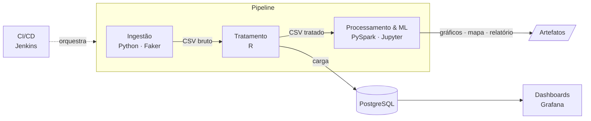

# Pipeline de Big Data para Vigilância de ISTs

**Pipeline de dados conteinerizado e ponta a ponta para analisar Infecções Sexualmente Transmissíveis (ISTs):
geração de dados, tratamento estatístico, processamento distribuído, machine learning e dashboards, com
orquestração via CI/CD.**


---

## Visão geral

Sistemas de vigilância em saúde pública recebem dados vindos de várias fontes, preenchidos à mão e cheios de
inconsistências. Este projeto implementa, em escala reduzida, a infraestrutura necessária para transformar esses
dados brutos em informação útil: um pipeline **reprodutível**, em que cada etapa roda isolada em seu próprio container
e todo o fluxo é executado com um único comando.

**Destaques**

- **Poliglota por responsabilidade:** Python para geração e processamento distribuído, R para análise estatística e
  tratamento, SQL para o data warehouse e os dashboards. Cada linguagem entra onde é mais forte.
- **Dados com ruído realista:** grafias inconsistentes, campos ausentes, outliers e datas impossíveis, tratados de forma
  explícita e auditável.
- **Modelagem dimensional + OLAP** em Spark SQL, e agregações no paradigma **MapReduce** sobre RDDs.
- **Machine learning com rigor metodológico:** comparação com baseline, análise de AUC e diagnóstico de vazamento de dados
  (veja [Análise e resultados](#análise-e-resultados)).
- **Infraestrutura como código:** o datasource e o dashboard do Grafana são provisionados automaticamente, e o Jenkins
  executa o pipeline de forma periódica.

## Arquitetura



| Etapa | Tecnologia | Responsabilidade | Saída |
|---|---|---|---|
| **Ingestão** | Python, Faker | Simula 10 mil registros de pacientes com ruído de preenchimento humano | `data/dados_ist_realistas.csv` |
| **Tratamento** | R | Análise exploratória, detecção de outliers, imputação, padronização de categorias, remoção de registros inválidos | CSV tratado + tabela no PostgreSQL |
| **Processamento & ML** | PySpark | Feature engineering, TF-IDF, data warehouse em esquema estrela, OLAP, MapReduce, classificação e clusterização | Gráficos, mapa interativo e notebook executado |
| **Visualização** | Grafana | Indicadores sobre os dados tratados | Dashboard provisionado |
| **Orquestração** | Jenkins, Docker Compose | Build e execução das etapas em sequência | — |

As etapas se comunicam apenas por **contratos de dados**: arquivos em um volume compartilhado ou tabelas no PostgreSQL.
Assim, cada uma pode ser executada, testada e substituída de forma independente.

## Início rápido

**Pré-requisito:** [Docker](https://www.docker.com/products/docker-desktop) com Docker Compose.

```bash
git clone https://github.com/itscaiocunha/algoritmo-doenca-ist.git
cd algoritmo-doenca-ist
mkdir bigdata_output
docker compose up --build
```

| Serviço | Acesso |
|---|---|
| Dashboard Grafana | http://localhost:3000 (`admin` / `admin`) |
| Jenkins | http://localhost:8080 |
| PostgreSQL | `localhost:5432` |
| Artefatos da análise | `bigdata_output/`, ou abra `web/index.html` para uma visão consolidada |

Para executar uma etapa isoladamente: `docker compose run --rm <gerador-dados | analise-dados | bigdata>`.

## Análise e resultados

### Tratamento de dados

Os dados brutos trazem problemas típicos de sistemas reais, e cada um recebe um tratamento explícito:

| Problema | Tratamento |
|---|---|
| Grafias inconsistentes (`"m"`, `"masculino"`, `"superio"`, `"fundamnetal"`...) | Padronização para categorias canônicas |
| Gênero e localidade ausentes | Categoria explícita `Não Informado`, sem imputar a moda para não enviesar a distribuição |
| Renda ausente | Imputação pela mediana, robusta aos outliers de renda |
| Datas de teste no futuro | Remoção dos registros inválidos |

### Machine learning

**Tarefa:** prever se um paciente tem IST a partir de idade, renda, gênero, localidade e escolaridade. Foram comparados
Regressão Logística, Random Forest e Naive Bayes contra um baseline de classe majoritária.

<p align="center">
  
  
</p>

| Modelo | Acurácia | AUC |
|---|---|---|
| Baseline (classe majoritária) | 0,636 | — |
| Regressão Logística | 0,590 | — |
| Naive Bayes | 0,565 | — |
| **Random Forest** | **0,637** | **0,822** |

**Leitura dos resultados.** A acurácia do Random Forest empata com o baseline, mas a **AUC de 0,82** mostra que o modelo
separa bem as classes. O sinal vem sobretudo da idade, já que cada IST se concentra em uma faixa etária (gráfico acima).
O gargalo está no **limiar de decisão** combinado ao desbalanceamento das classes, não na falta de informação. É um
exemplo concreto de por que a acurácia, sozinha, é uma métrica inadequada nesse cenário.

Na clusterização (K-Means sobre features padronizadas), o custo cai de forma linear, sem "cotovelo". Isso é coerente
com dados cujos atributos são simulados de forma independente, e indica que não há estrutura natural de grupos.

*Os dados são gerados a cada execução, então os valores variam levemente; os padrões se mantêm.*

### Revisão metodológica

A primeira versão do projeto (2025, preservada na tag [`v1.0-pi-2025`](../../tree/v1.0-pi-2025)) relatava
**100% de acurácia**. Uma revisão posterior identificou a causa: **vazamento de dados**. A coluna `doenca`, da qual o
rótulo é derivado, estava entre as features. A mesma revisão encontrou falhas no tratamento (localidades exportadas como
`NA`, datas futuras não removidas, gênero ausente imputado como "Masculino") e um K-Means sem padronização, dominado pela
escala da renda.

Cada correção está documentada em um commit próprio no histórico do repositório. Os números acima já refletem a versão
corrigida.

## Estrutura do repositório

```
services/
├── gerador_dados/      Ingestão: pacote `gerador` (config de domínio + geradores)
├── analise_r/          Tratamento: exploração, tratamento e exportação em módulos R
└── bigdata/            Processamento & ML
    ├── ist_bigdata/    Pacote com um módulo por etapa (warehouse, olap, mapreduce, classificacao...)
    └── main.ipynb      Relatório executável que orquestra o pacote
infra/
├── grafana/            Provisionamento do datasource e do dashboard
└── jenkins/            Imagem do Jenkins com Docker CLI
web/                    Página estática com os resultados
docker-compose.yml      Orquestração dos serviços
Jenkinsfile             Pipeline de CI/CD
```

**Decisões de projeto**

- **Lógica fora do notebook:** o código de análise vive em um pacote Python modular e testável; o notebook apenas
  orquestra as chamadas e documenta os resultados.
- **Configuração centralizada:** as constantes de domínio ficam em um módulo `config` por serviço, e credenciais e portas
  vêm de variáveis de ambiente, com valores padrão que permitem rodar sem nenhuma configuração.
- **Transformações explícitas:** no R, o tratamento é uma cadeia de funções puras (`dados |> imputar() |> padronizar()`),
  o que deixa a ordem das operações evidente e fácil de auditar.

## Configuração

Todas as variáveis são opcionais. Para sobrescrever os valores padrão, copie o arquivo `.env.example` para `.env`.

| Variável | Padrão | Uso |
|---|---|---|
| `POSTGRES_USER` / `POSTGRES_PASSWORD` / `POSTGRES_DB` | `admin_ist` / `istunifeob` / `ist_db` | Banco e datasource do Grafana |
| `POSTGRES_PORT` | `5432` | Porta exposta do PostgreSQL |
| `GRAFANA_ADMIN_USER` / `GRAFANA_ADMIN_PASSWORD` | `admin` / `admin` | Login do Grafana |
| `GRAFANA_PORT` / `JENKINS_PORT` | `3000` / `8080` | Portas expostas |

## Limitações e próximos passos

- **Dados sintéticos:** as distribuições foram definidas manualmente. Um próximo passo natural é integrar bases públicas,
  como o **DATASUS/SINAN**.
- **Modelagem:** balanceamento de classes, ajuste do limiar pela curva ROC, validação cruzada e seleção de modelos por
  AUC/F1 da classe positiva.
- **Escala:** o Spark roda em modo local. A arquitetura permite migrar para um cluster sem alterar o código de análise.
- **Qualidade:** testes automatizados das transformações e validação de schema entre as etapas.

## Créditos

Projeto desenvolvido originalmente em 2025 por **Caio Grilo da Cunha**, **Gian Carlos de Freitas Moroni**,
**Haryel Araújo de Oliveira Caliari** e **Jackeline Ayumi Kanekiyo**, como Projeto Integrador de Data Science na UNIFEOB.
Arquitetura e metodologia revisadas em 2026.
